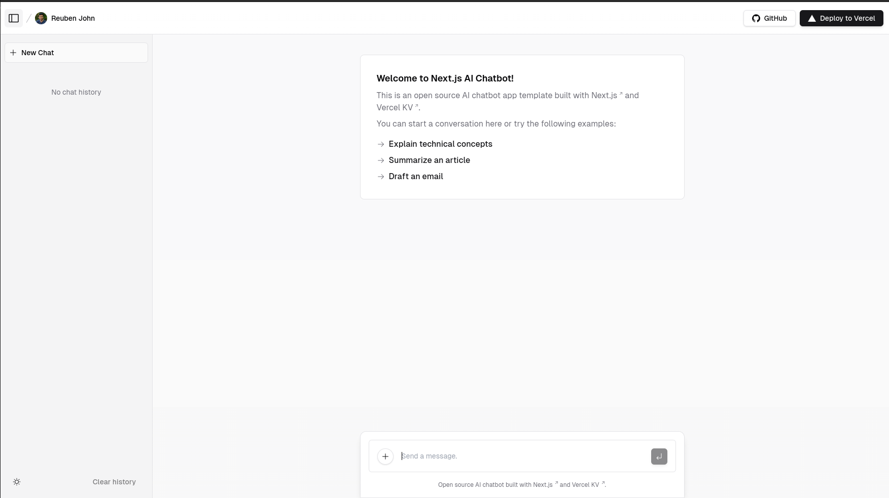

# [Task Companion UI](https://task-companion.vercel.app/)

<p align="center">
  Task Companion is a digital assistant that uses chat and visual interfaces to manage your to-do list and schedule, learning from your interactions to become more helpful over time.
</p>

<p align="center">
  <a href="#features"><strong>Features</strong></a> ·
  <a href="#roadmap"><strong>Roadmap</strong></a> ·
  <a href="#deployment"><strong>Deployment</strong></a> ·
  <a href="#running-locally"><strong>Running locally</strong></a> ·
  <a href="#authors"><strong>Authors</strong></a>
</p>
<br/>

## Features

- OpenAI `gpt-3.5-turbo` powered chat interface.
- User interface to manage the to-do list (left-pane).
- Dynamic event feed showcasing task activities, offering real-time to-do list updates and chats (right-pane).
- GitHub authentication with [NextAuth.js](https://github.com/nextauthjs/next-auth) for secure access.

## Roadmap

- Ability for the LLM to answer questions about created tasks.
- AI can ask questions and make suggestions about created or modified tasks.
- AI creates tasks.
- AI suggests tasks modifications (priority, deadline, title, description, subtasks, etc).
- AI responds to user app interactions (complete task, change deadline, etc)
- AI suggests new tasks.
- AI set task reminders.
- AI responds to external events (location, email, etc)
- Ability to learn from user feedback and confirmations to improve the LLM's accuracy.
- Runs on device with fallback to cloud LLM when in doubt.

## Deployment

### Deploy to Vercel

See [Vercel Deployments](https://vercel.com/docs/deployments/overview).

Or, start with the following one-click template, and then manually swap in the Task Companion UI code.  
[](https://vercel.com/new/clone?demo-title=Next.js+Chat&demo-description=A+full-featured%2C+hackable+Next.js+AI+chatbot+built+by+Vercel+Labs&demo-url=https%3A%2F%2Fchat.vercel.ai%2F&demo-image=%2F%2Fimages.ctfassets.net%2Fe5382hct74si%2F4aVPvWuTmBvzM5cEdRdqeW%2F4234f9baf160f68ffb385a43c3527645%2FCleanShot_2023-06-16_at_17.09.21.png&project-name=Next.js+Chat&repository-name=nextjs-chat&repository-url=https%3A%2F%2Fgithub.com%2Fvercel-labs%2Fai-chatbot&from=templates&skippable-integrations=1&env=OPENAI_API_KEY%2CAUTH_GITHUB_ID%2CAUTH_GITHUB_SECRET%2CAUTH_SECRET&envDescription=How+to+get+these+env+vars&envLink=https%3A%2F%2Fgithub.com%2Fvercel-labs%2Fai-chatbot%2Fblob%2Fmain%2F.env.example&teamCreateStatus=hidden&stores=[{"type":"kv"}])

The python backend is still a work in progress. No documentation exists as of writing this document.

### Creating a KV Database Instance

Follow the steps outlined in the [quick start guide](https://vercel.com/docs/storage/vercel-kv/quickstart#create-a-kv-database) provided by Vercel. This guide will assist you in creating and configuring your KV database instance on Vercel, enabling your application to interact with it.

Remember to update your environment variables (`KV_URL`, `KV_REST_API_URL`, `KV_REST_API_TOKEN`, `KV_REST_API_READ_ONLY_TOKEN`) in the `.env` file with the appropriate credentials provided during the KV database setup.

## Running locally

You will need to use the environment variables [defined in `.env.example`](.env.example) to run Next.js AI Chatbot. It's recommended you use [Vercel Environment Variables](https://vercel.com/docs/projects/environment-variables) for this, but a `.env` file is all that is necessary.

> Note: You should not commit your `.env` file or it will expose secrets that will allow others to control access to your various OpenAI and authentication provider accounts.

1. Install Vercel CLI: `npm i -g vercel`
2. Link local instance with Vercel and GitHub accounts (creates `.vercel` directory): `vercel link`
3. Download your environment variables: `vercel env pull`

```bash
pnpm install
pnpm dev
```

The local instance should now be running on [localhost:3000](http://localhost:3000/).

## Authors & Attribution

### Chat AI Vercel Template
The starting point of this project is the [chat-ai vercel template](https://github.com/vercel/ai-chatbot) created by [Vercel](https://vercel.com) and [Next.js](https://nextjs.org) team members, with contributions from:

- Jared Palmer ([@jaredpalmer](https://twitter.com/jaredpalmer)) - [Vercel](https://vercel.com)
- Shu Ding ([@shuding\_](https://twitter.com/shuding_)) - [Vercel](https://vercel.com)
- shadcn ([@shadcn](https://twitter.com/shadcn)) - [Vercel](https://vercel.com)

### Task Companion UI
However, all subsequent development of the Task Companion UI is primarily by
[reubenjohn](https://github.com/reubenjohn). See the Git history for details.